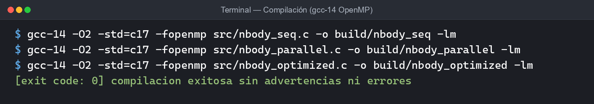
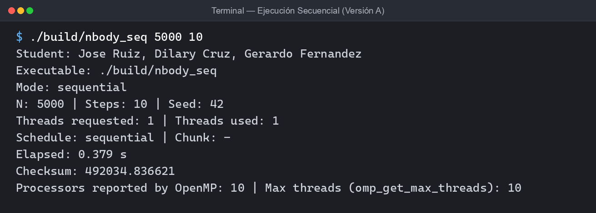
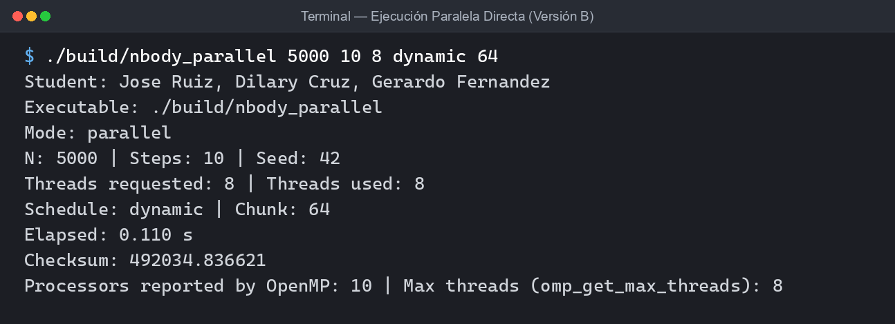
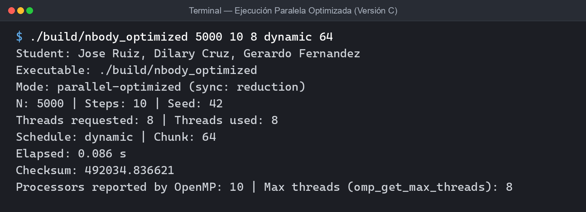
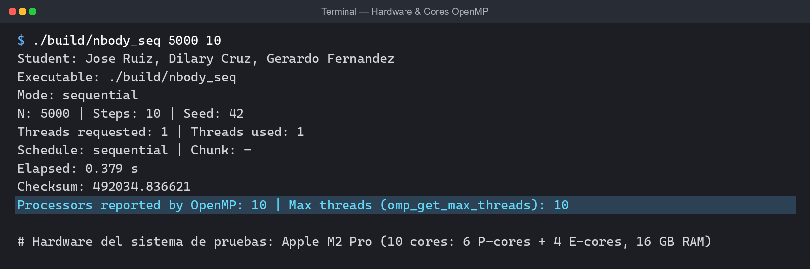

# 1. Resumen y entorno de medición

Se implementaron tres versiones en **C (C17) con OpenMP**: `nbody_seq.c` (A, baseline), `nbody_parallel.c` (B, cada cuerpo acumula su fuerza) y `nbody_optimized.c` (C, cada par $(i,j)$ se calcula una sola vez). Todas usan `seed = 42`, $N=5000$, 10 pasos, $dt=0.01$, y miden con `omp_get_wtime()`. Cada configuración se ejecutó **3 veces** y se reporta el promedio (`results.csv`, generado por `run_experiments.sh`).

**Hardware:** Apple M2 Pro, 10 núcleos (6 de rendimiento + 4 de eficiencia), 16 GB; `omp_get_num_procs() = 10`. Compilador: GCC 14.2 (`-O2 -std=c17 -fopenmp`). Hay que tener en cuenta que los 8 hilos se reparten entre núcleos heterogéneos y que la corrida completa dura menos de 0.4 s, por lo que la variación entre corridas es de varios por ciento.

# 2. Diseño PCAM

**P – Partition.** La unidad paralelizable es *el cálculo de la fuerza total sobre el cuerpo $i$* en un paso (iteración del ciclo externo). La unidad mínima es una interacción $(i,j)$, pero no se usa como tarea (ver pregunta 1). Las tareas de un mismo paso son independientes entre sí porque todas leen las posiciones del instante $t$. Entre pasos hay dependencia estricta ($t+1$ necesita el estado final de $t$) y dentro de un paso hay una barrera entre calcular fuerzas y mover cuerpos, de modo que ningún cuerpo se mueva antes de que todos hayan visto las posiciones de $t$. En B y C el fin del `parallel for` provee esa barrera implícita.

**C – Communication.** *Solo lectura compartida:* `x`, `y`, `mass` de todos los cuerpos (leídos por todos los hilos, sin protección). *Escrituras:* en B cada hilo escribe únicamente `vx[i]`, `vy[i]` de su propio $i$, por lo que no hay carreras. En C la ley de Newton ($F_{ij}=-F_{ji}$) hace que el par $(i,j)$ escriba en los acumuladores de **dos** cuerpos (`fx[i]`, `fx[j]`), y `j` puede ser un cuerpo que otro hilo está procesando como `i`: *ahí* está la carrera. Los acumuladores `fx`, `fy` son lo único que hay que sincronizar o combinar.

**A – Agglomeration.** Se aglomeran todas las interacciones de un cuerpo en una sola tarea (unos $N$ pares por tarea) y, con `chunk`, varios cuerpos consecutivos por asignación del scheduler. Se compararon chunks de 1, 8, 64 y 512 (más el default) para observar cómo la granularidad afecta el tiempo.

**M – Mapping.** Se asigna con `schedule(runtime)` y se compara `static`, `dynamic` y `guided` con distintos chunks. En B cada tarea cuesta lo mismo ($N-1$ interacciones), por lo que `static` sería el candidato natural. En C el ciclo `j = i+1..N` es **triangular**: la tarea $i$ cuesta $N-i-1$ pares, y el primer hilo con `static` por bloques (8 hilos) recibe ~15 veces más trabajo que el último. Este desbalance explica por qué `dynamic` y con chunk pequeño resulta mucho mejor en C.

# 3. Estrategia OpenMP y análisis de race conditions

* **B:** `#pragma omp parallel for schedule(runtime)` sobre $i$, con `fx`, `fy` locales al hilo. No hay race conditions. El movimiento de posiciones va en un segundo `parallel for` después de la barrera implícita.
* **C:** se probaron tres formas de resolver la carrera sobre `fx[i], fy[i], fx[j], fy[j]`, compiladas del mismo fuente (`-DSYNC_ATOMIC`, `-DSYNC_CRITICAL`, o por defecto `reduction`):

| Estrategia | Tiempo 8 hilos, dynamic 64 (s) | Speedup | Comentario |
|---|---|---|---|
| `reduction(+:fx[:N], fy[:N])` | **0.0687** | **5.18** | Copia privada por hilo, sumadas al final; sin sincronización en el ciclo caliente. |
| `omp atomic` (4 por par) | 0.5463 | 0.65 | Correcto, pero ~50 millones de operaciones atómicas por paso (12.5 M pares × 4); **más lenta que la secuencial**. |
| `omp critical` (1 por par) | 2.5890 | 0.14 | Serializa por completo el núcleo del cálculo. |

Se **eligió `reduction`** porque elimina la contención: cuesta memoria extra ($2N$ doubles por hilo, ~80 KB/hilo) y una fase de combinación de $O(N\cdot p)$, ambas despreciables frente a $O(N^2)$. Con hilos *privados* no hay carrera en el ciclo y el resultado es correcto; la diferencia numérica máxima frente a la secuencial es $2.2\times10^{-8}$ (ver sección 4).

# 4. Resultados ($N=5000$, 10 pasos, promedio de 3 corridas)

Speedup $S(p)=T_1/T_p$ con $T_1=0.355$ s (secuencial) y eficiencia $E(p)=S(p)/p$. MaxDiff es la diferencia absoluta máxima en $x,y,v_x,v_y$ frente a la versión secuencial.

| Threads | Schedule | Chunk | B directa T (s) | S | E | C optimizada T (s) | S | E |
|--:|---|---|--:|--:|--:|--:|--:|--:|
| 1 | sequential | - | 0.355 | 1.00 | 1.00 | – | – | – |
| 2 | static | default | 0.281 | 1.26 | 0.63 | 0.346 | 1.03 | 0.51 |
| 4 | static | default | 0.150 | 2.36 | 0.59 | 0.200 | 1.78 | 0.45 |
| 8 | static | default | 0.111 | 3.20 | 0.40 | 0.116 | 3.05 | 0.38 |
| 8 | static | 8 | 0.113 | 3.15 | 0.39 | 0.084 | 4.21 | 0.53 |
| 8 | static | 64 | 0.111 | 3.21 | 0.40 | 0.086 | 4.13 | 0.52 |
| 8 | dynamic | 8 | 0.093 | 3.83 | 0.48 | 0.069 | 5.12 | 0.64 |
| 8 | dynamic | 64 | 0.089 | 4.01 | 0.50 | 0.069 | 5.17 | 0.65 |
| 8 | guided | default | 0.099 | 3.59 | 0.45 | 0.123 | 2.89 | 0.36 |
| 2 | dynamic | 64 | – | – | – | 0.230 | 1.54 | 0.77 |
| 4 | dynamic | 64 | – | – | – | 0.117 | 3.03 | 0.76 |

Chunks adicionales con 8 hilos (T en s): **static** 1 / 512 = B 0.113 / 0.201, C 0.085 / 0.119; **dynamic** 1 / 512 = B 0.129 / 0.117, C 0.073 / 0.096; **guided** 8 / 64 = B 0.097 / 0.100, C 0.111 / 0.112.

**Corrección numérica.** El checksum es **492034.836621** en A, B y C (6 decimales idénticos). La diferencia máxima frente a A es exactamente $0$ para B (mismo orden de sumas por cuerpo) y entre $1.1\times10^{-8}$ y $2.2\times10^{-8}$ para C. Esta variación se debe únicamente a que la suma de fuerzas de C se hace en otro orden (reducción por hilo, y $F_{ji}=-F_{ij}$ calculado una vez), y la suma en punto flotante no es asociativa; es un error de redondeo, no una divergencia física.

\newpage

# 5. Preguntas de análisis

1. **Unidad mínima.** Una interacción $(i,j)$ (~20 flops). Como tarea individual, el costo de despachar la tarea y sincronizar es mucho mayor que su cálculo. Por eso se aglomeran las $N$ interacciones de un cuerpo (A de PCAM).
2. **Datos compartidos.** Solo lectura: `x, y, mass` durante el cálculo de fuerzas. Requieren protección: en C los acumuladores `fx, fy` (resuelto con `reduction`). En B no hay escrituras compartidas.
3. **Efecto del chunk.** Chunk muy grande perjudica: con 8 hilos y `static` 512, B sube de 0.111 a 0.201 s (con `dynamic` 512: 0.117 s en B y 0.096 s en C) porque quedan pocos chunks (~10 de 512) y el último desbalancea. Chunk 1 en `dynamic` paga más overhead de scheduling (chunk 1 vs 8: 0.129 vs 0.093 s en B y 0.073 vs 0.069 s en C). El óptimo es intermedio (8–64), donde el overhead se amortiza sin perder balance: eso es Agglomeration.
4. **static vs dynamic vs guided.** En ambas versiones `dynamic` fue el mejor (B 0.089 s y C 0.069 s con chunk 64, frente a `static` 0.111 y 0.116 s), respaldado por las tablas de la sección 4. En B, con carga uniforme, la ventaja (~20 %) se atribuye a que dynamic absorbe la interferencia del SO y del hardware heterogéneo (núcleos P y E, ver pregunta 7). En C, la carga triangular hace que el efecto sea mucho mayor: `static` por default deja al primer hilo con ~15x la carga del último. `guided` fue intermedio en B (0.099 s) y **peor** en C con default (0.123 s), porque sus chunks iniciales son enormes y caen en las primeras filas, que son las más caras.
5. **Race condition en C.** El par $(i,j)$ actualiza `fx[i], fy[i]` y `fx[j], fy[j]`; otro hilo que procesa $j$ (como su propio `i`) o $k$ escribe el mismo `fx[j]` en paralelo: lecturas-modificaciones-escrituras perdidas. Se resolvió con acumuladores privados por hilo (`reduction` sobre arreglos) y se comparó con `atomic` y `critical` (sección 3).
6. **¿Menos operaciones = más rápida?** No siempre. C hace la mitad de interacciones, y con `dynamic` 64 gana a B (0.069 vs 0.089 s, S = 5.17 vs 4.01). Pero con `static` por default y 2 o 4 hilos C es *más lenta* que B (2 hilos: 0.346 vs 0.281 s) por el desbalance triangular y porque cada hilo debe inicializar y combinar sus copias de `fx, fy`. Con `guided` default (0.123 vs 0.099 s) también pierde. Además, C con `atomic` (0.546 s) o `critical` (2.59 s) es mucho más lenta que la secuencial, pese a hacer menos operaciones aritméticas: la sincronización domina.
7. **Speedup y eficiencia (B, static default / mejor C).** 2 hilos: S = 1.26 / E = 0.63 (B), S = 1.54 / E = 0.77 (C dyn 64). 4 hilos: S = 2.36 / E = 0.59 (B), S = 3.03 / E = 0.76 (C). 8 hilos: S = 3.20 / E = 0.40 (B static), S = 4.01 / E = 0.50 (B dynamic 64), S = 5.17 / E = 0.65 (C dynamic 64). Deja de escalar linealmente desde 2 hilos (E < 1) y se degrada más al pasar a 8, sobre todo porque el M2 Pro tiene solo 6 núcleos de alto rendimiento y 4 de eficiencia más lentos: 8 hilos ya usan núcleos E, y `dynamic` lo compensa mejor que `static`. También influye que el tiempo total es de ~0.1 s, así que el costo fijo de crear equipos de hilos y la parte secuencial (Amdahl) pesan.
8. **¿64 cores = 8x?** No lo esperaríamos. Con 8 hilos la eficiencia ya cayó a 0.40–0.65, y el speedup no fue 8x con 8 hilos sino 3.2–5.2x. Con 64 hilos y sólo $N=5000$ (78 cuerpos por hilo), el overhead de scheduling, la creación del equipo de hilos, y en C el costo de combinar 64 copias de $2N$ doubles crecerían mientras el trabajo por hilo se reduce (Amdahl y sobrecarga). Habría que aumentar $N$ (trabajo $O(N^2)$) para escalar de forma útil.

\newpage

# 6. Conclusiones

* El paralelismo por cuerpo es natural para N-Body: las tareas son independientes dentro de un paso y la única sincronización necesaria es la barrera entre pasos.
* La mejor configuración fue **C (pares únicos) con `reduction`, `dynamic`, chunk 64 y 8 hilos**: 0.069 s, speedup 5.17 (E = 0.65), con resultado numéricamente equivalente a la secuencial (diferencia máxima $2.2\times10^{-8}$, mismo checksum).
* En cuanto a la sincronización, la elección de la estrategia contra la race condition fue lo más determinante: `reduction` (5.18x) contra `atomic` (0.65x) y `critical` (0.14x).
* El chunk y el schedule importan más de lo esperado: `dynamic` con chunks de 8–64 fue el mejor en ambas versiones; chunks de 512 (y chunk 1 en B) y `guided` con chunk default fueron los peores, `guided` en especial en la versión triangular.
* Limitaciones: $N=5000$ con 10 pasos produce corridas de <0.4 s, por lo que hay ruido de medición (varios %) y las diferencias menores a ~5 % no son concluyentes. Los núcleos heterogéneos del M2 Pro limitan la eficiencia con 8 hilos.

\newpage

# Anexo A. Evidencia de ejecución

Salidas reales (los originales están en `evidence/`). Las capturas de pantalla (`compile.png`, `sequential.png`, `parallel.png`, `optimized.png`, `hardware.png`) se incluyen a continuación.

{width=85%}

{width=85%}

{width=85%}

{width=85%}

{width=85%}
